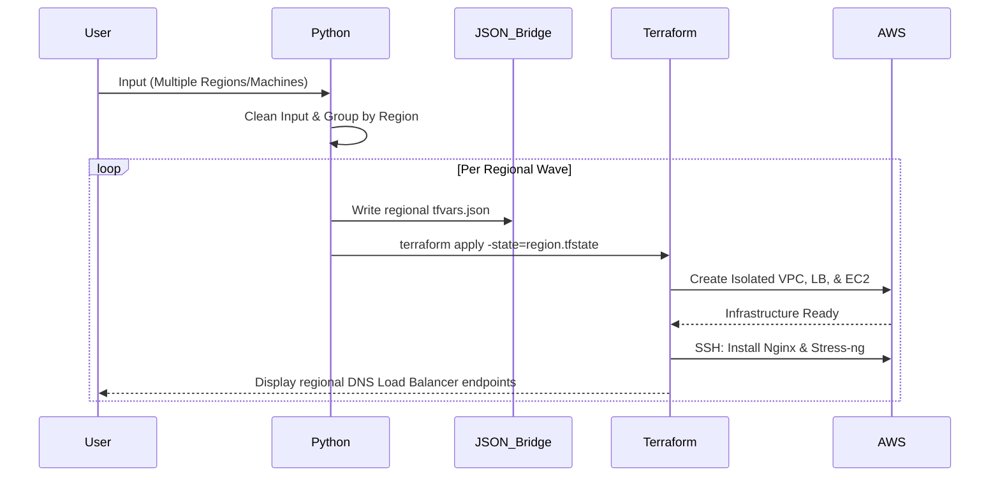

# Architecture Overview: Python to AWS Automation

This document details the high-level design and data flow of the DevOps infrastructure automation tool. The system is designed to provide **completely isolated environments** across multiple global regions.

## Core Design Principles

1.  **Isolation per Machine**: Each instance is provisioned in its own dedicated VPC with its own Load Balancer. This ensures zero cross-contamination.
2.  **Stateless Orchestration**: The Python layer acts as the brain, grouping machines by region and managing regional Terraform state archives.
3.  **Human-Centric Validation**: Pydantic models validate AWS constraints and automatically correct common user input errors.

---

## Step-by-Step Data Flow

### 1. Configuration & Validation (Python)
- **User Input**: `MachineCreator` collects specifications (Region, AMI, Instance Type).
- **Cleaning**: The `Machine` model automatically strips special characters (brackets `[]`, quotes) from inputs.
- **Verification**: Validates that instance types belong to the permitted families (`t` or `m`).

### 2. Regional "Waves" (The Orchestrator)
To avoid Terraform provider conflicts, `infra_simulator.py` groups machines by region.
- **Wave Execution**: It runs one full Terraform cycle per region.
- **State Sequestration**: Each region maintains a unique state file (e.g., `terraform.us-east-1.tfstate`), allowing for independent management and cleanup.

### 3. The JSON Variable Bridge
- Python writes a temporary `terraform.tfvars.json` for the current region wave.
- Terraform reads this file to dynamically populate the `instances` and `aws_region` variables.

### 4. Infrastructure Provisioning (Terraform)
- **Isolated VPC Layer**: Provisions VPCs, Subnets, and Gateways.
- **Load Balancing Layer**: Creates dedicated Application Load Balancers for every machine.
- **Compute Layer**: Provisions EC2 instances based on user specs.

### 5. Automated Service Bootstrap
Immediately after provisioning, Terraform uses `remote-exec` over SSH to:
- Install **Nginx** and **Stress-ng**.
- Deploy a "Healthy" status page to the web server.

---

## Multi-Region System Diagram

---

## Key Files & Responsibilities

| File | Role |
| :--- | :--- |
| **[infra_simulator.py](./infra-automation/src/infra_simulator.py)** | Handles the multi-region loop and state isolation. |
| **[machine.py](./infra-automation/src/machine.py)** | Pydantic model for validation and input cleaning. |
| **[main.tf](./infra-automation/Terraform/Modules/Deployments/main.tf)** | The infrastructure blueprint for Isolated Stacks. |